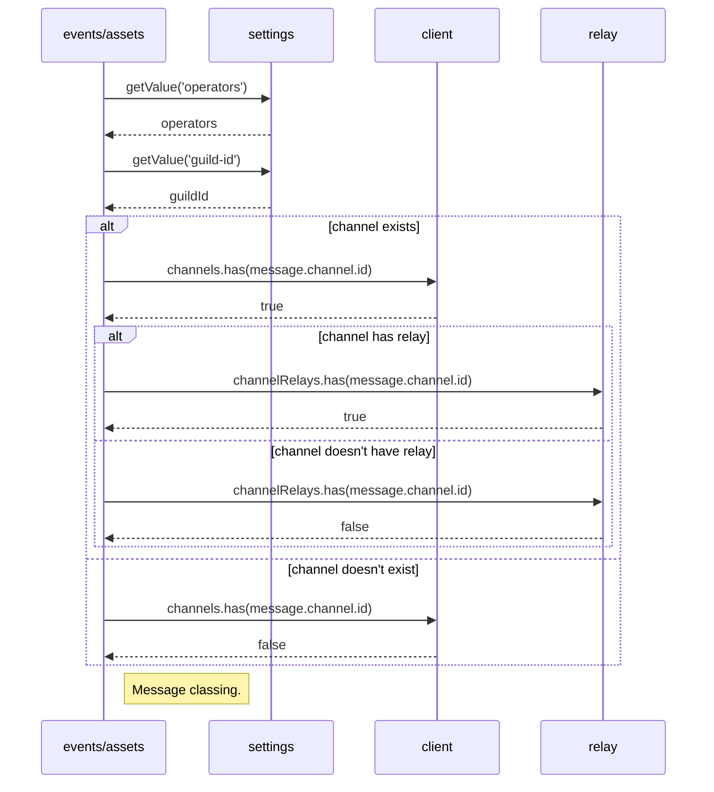
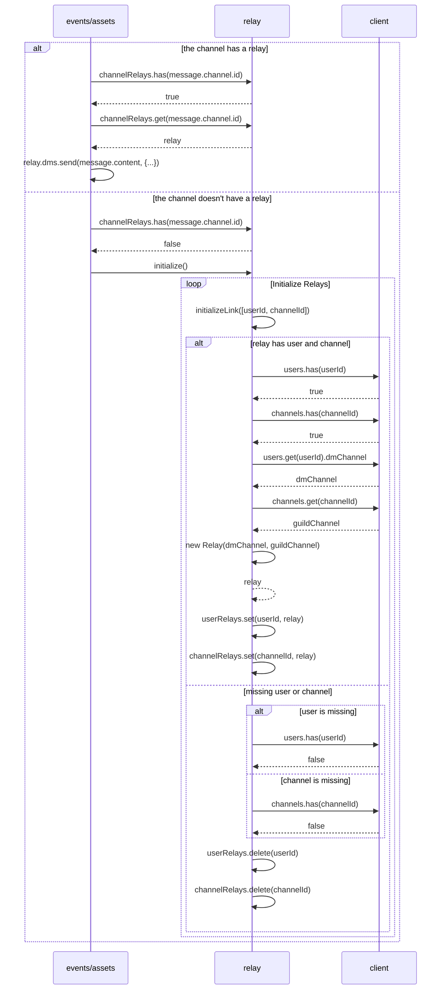
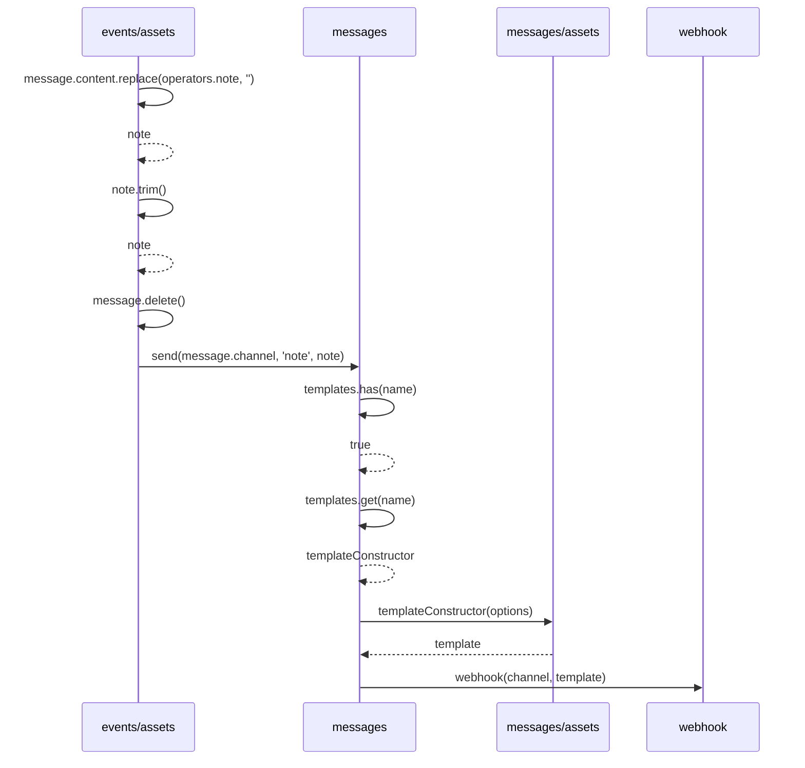
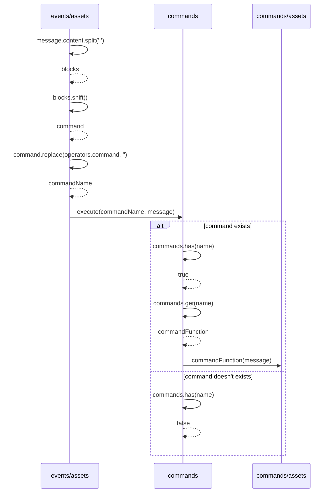

# Documentation for events/assets/messages.js

## The process of handling the message event

## The classification of messages

A message is classified as `incoming` if:
* The message comes from a DM channel
* The message was not sent by the client user

A message is classified as `relayable` if:
* The message was not sent by a bot
* The message is neither a command or note message
* The channel has an associated relay

A message is classified as `note` if:
* The message was not sent by a bot
* The message was sent in the DMs guild
* The message starts with the note operator

A message is classified as `command` if:
* The message was not sent by a bot
* The message was set in the DMs guild
* The message starts with the command operator

## Post-classification
If the message was classified, the handling is now determined by its class Otherwise, the message is unclassified and will not be handled

## The process of handling an `incoming` message

```mermaid
  sequenceDiagram

    alt user has relay

      events/assets ->> relay: userRelays.has(message.author.id)
      relay -->> events/assets: true
      events/assets ->> relay: userRelays.get(message.author.id)
      relay -->> events/assets: relay

      alt relay has a channel

        events/assets ->> client: channels.has(relay.channel.id)
        client -->> events/assets: true

        events/assets ->> messages: send(relay.channel, 'message', message)
        messages ->> messages: templates.has(name)
        messages -->> messages: true
        messages ->> messages: templates.get(name)
        messages -->> messages: templateConstructor
        messages ->> messages/assets: templateConstructor(initialMessage)

        alt user has a profile
          messages/assets ->> users: profiles.has(message.author.id)
          users -->> messages/assets: true
          messages/assets ->> users: profiles.get(message.author.id)
          users -->> messages/assets: profile
          messages/assets ->> messages/assets: profile.getProperty('name')
          messages/assets -->> messages/assets: profileName
          messages/assets ->> messages/assets: profile.getProperty('profile-picture')
          messages/assets -->> messages/assets: profilePicture
        else user doesn't have a profile
          messages/assets ->> users: profiles.has(message.author.id)
          users -->> messages/assets: false
        end

        messages/assets -->> messages: template
      
        messages ->> webhook: webhook(channel, template)

      else relay doesn't have a channel

        events/assets ->> client: channels.has(relay.channel.id)
        client -->> events/assets: false

        events/assets ->> relay: initialize()
        
        loop Initialize Relays
          relay ->> relay: initializeLink([userId, channelId])

          alt relay has user and channel
          
            relay ->> client: users.has(userId)
            client -->> relay: true
            relay ->> client: channels.has(channelId)
            client -->> relay: true

            relay ->> client: users.get(userId).dmChannel
            client -->> relay: dmChannel

            relay ->> client: channels.get(channelId)
            client -->> relay: guildChannel

            relay ->> relay: new Relay(dmChannel, guildChannel)
            relay -->> relay: relay

            relay ->> relay: userRelays.set(userId, relay)
            relay ->> relay: channelRelays.set(channelId, relay)

          else missing user or channel

            alt user is missing

              relay ->> client: users.has(userId)
              client -->> relay: false

            else channel is missing

              relay ->> client: channels.has(channelId)
              client -->> relay: false
            end

            relay ->> relay: userRelays.delete(userId)
            relay ->> relay: channelRelays.delete(channelId)
          end
        end

        events/assets ->> relay: createRelay(user, initialMessage)
      
        alt user has a profile

          relay ->> users: profiles.has(user.id)
          users -->> relay: true
          relay ->> users: profiles.get(user.id)
          users -->> relay: profile
          relay ->> relay: profile.getValue('name')
          relay -->> relay: profileName

        else user doesn't have a profile

          relay ->> users: profiles.has(user.id)
          users -->> relay: false
          relay ->> users: createProfile(user.id, {...})
          users ->> users: initializeProfile(fileName)
          users ->> client: users.has(user.id)
          client -->> users: true
          users ->> users: profiles.set(id, profile)
        end

        relay ->> guild: createChannel(profileName || user.username, {...})
        guild -->> relay: channel

        relay ->> relay: initializeLink([user.id, channel.id])

        relay ->> client: users.has(user.id)
        client -->> relay: true
        relay ->> client: channels.has(channel.id)
        client -->> relay: true

        relay ->> relay: userRelays.set(user.id, relay)
        relay ->> relay: channelRelays.set(channel.id, relay)

        relay ->> messages: send(channel, 'new-channel', user)
        messages ->> messages: templates.has(name)
        messages -->> messages: true
        messages ->> messages: templates.get(name)
        messages -->> messages: templateConstructor
        messages ->> messages/assets: templateConstructor(user)
        messages/assets -->> messages: template

        messages ->> webhook: webhook(channel, template)

        relay ->> messages: send(channel, 'message', initialMessage)
        messages ->> messages: templates.has(name)
        messages -->> messages: true
        messages ->> messages: templates.get(name)
        messages -->> messages: templateConstructor
        messages ->> messages/assets: templateConstructor(initialMessage)
        messages/assets ->> users: profiles.has(message.author.id)
        users -->> messages/assets: true
        messages/assets ->> users: profiles.get(message.author.id)
        users -->> messages/assets: profile
        messages/assets ->> messages/assets: profile.getProperty('name')
        messages/assets ->> messages/assets: profile.getProperty('profile-picture')
        messages/assets -->> messages: template
        
        messages ->> webhook: webhook(channel, template)
      end

    else user dosen't have relay

      events/assets ->> relay: userRelays.has(message.author.id)
      relay -->> events/assets: false
      events/assets ->> relay: createRelay(user, initialMessage)
      
      alt user has profile

        relay ->> users: profiles.has(user.id)
        users -->> relay: true
        relay ->> users: profiles.get(user.id)
        users -->> relay: profile
        relay ->> relay: profile.getValue('name')
        relay -->> relay: profileName

      else user doesn't have profile

        relay ->> users: profiles.has(user.id)
        users -->> relay: false
        relay ->> users: createProfile(user.id, {...})
        users ->> users: initializeProfile(fileName)
        users ->> client: users.has(user.id)
        client -->> users: true
        users ->> users: profiles.set(id, profile)
      end

      relay ->> guild: createChannel(profileName || user.username, {...})
      guild -->> relay: channel

      relay ->> relay: initializeLink([user.id, channel.id])

      relay ->> client: users.has(user.id)
      client -->> relay: true
      relay ->> client: channels.has(channel.id)
      client -->> relay: true

      relay ->> relay: userRelays.set(user.id, relay)
      relay ->> relay: channelRelays.set(channel.id, relay)

      relay ->> messages: send(channel, 'new-channel', user)
      messages ->> messages: templates.has(name)
      messages -->> messages: true
      messages ->> messages: templates.get(name)
      messages -->> messages: templateConstructor
      messages ->> messages/assets: templateConstructor(user)
      messages/assets -->> messages: template

      messages ->> webhook: webhook(channel, template)

      relay ->> messages: send(channel, 'message', initialMessage)
      messages ->> messages: templates.has(name)
      messages -->> messages: true
      messages ->> messages: templates.get(name)
      messages -->> messages: templateConstructor
      messages ->> messages/assets: templateConstructor(initialMessage)
      messages/assets ->> users: profiles.has(message.author.id)
      users -->> messages/assets: true
      messages/assets ->> users: profiles.get(message.author.id)
      users -->> messages/assets: profile
      messages/assets ->> messages/assets: profile.getProperty('name')
      messages/assets ->> messages/assets: profile.getProperty('profile-picture')
      messages/assets -->> messages: template
      
      messages ->> webhook: webhook(channel, template)
    end
```

## The process of handling a `relayable` message

## The process of handling a `note` message

## The process of handling a `command` message

