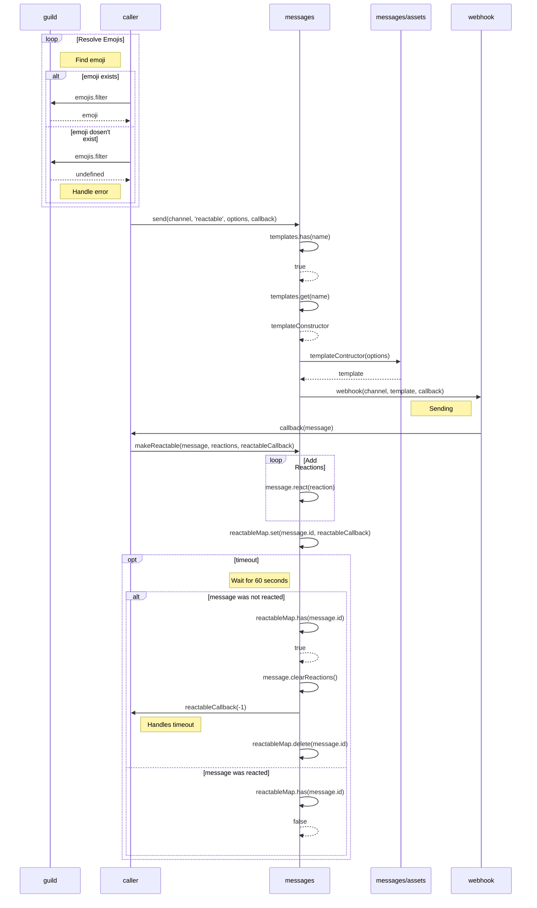
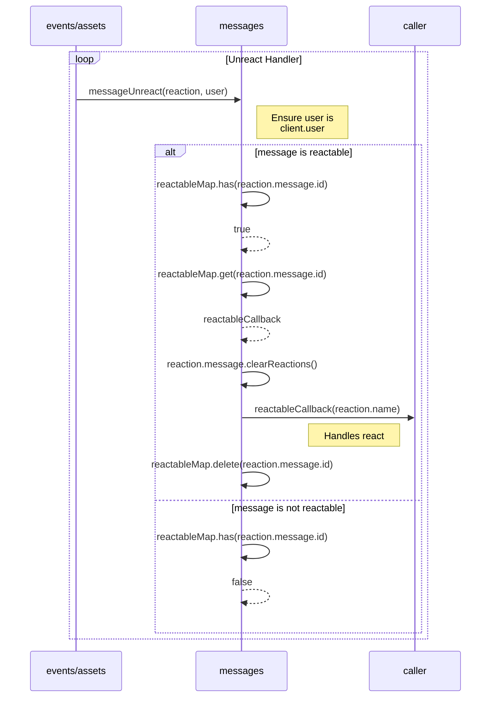

### This details the process of sending and setting up a reactable message.

### This describes the events/assets/messageReactionRemoved.js file's interaction with messages/index.js in the form of an unreact handler.

